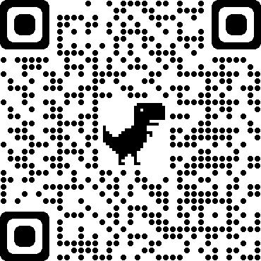
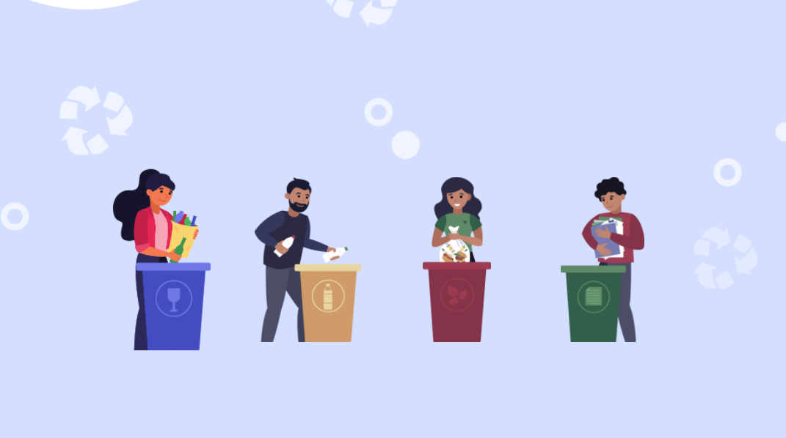
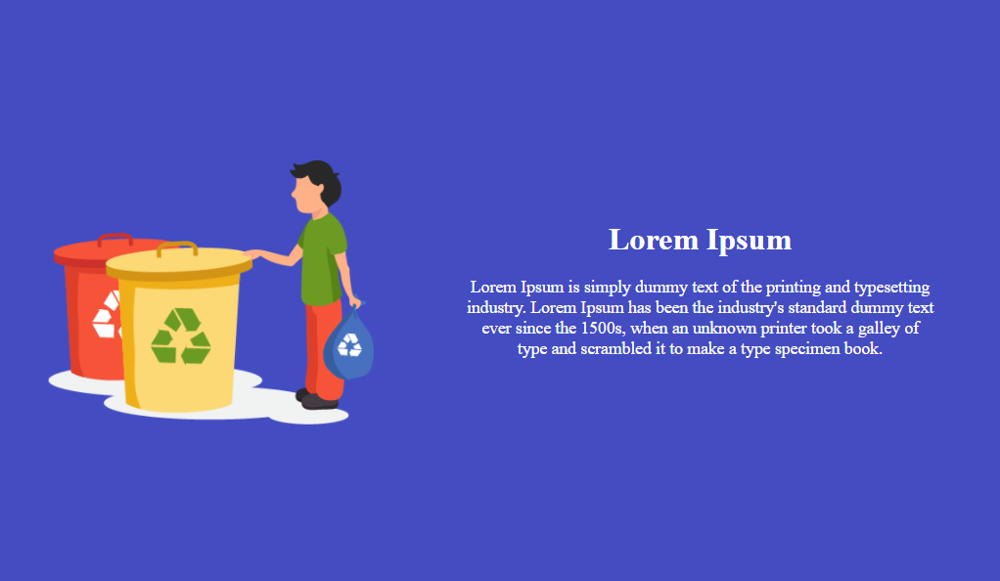
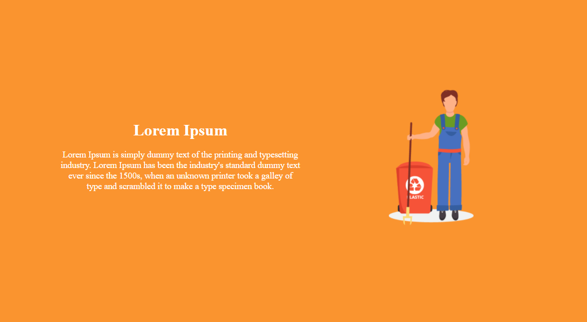
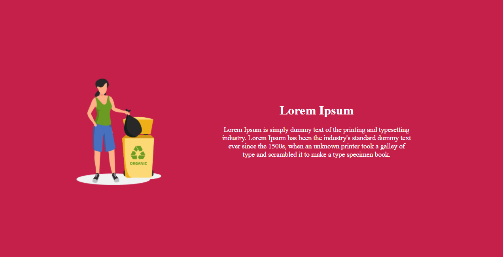
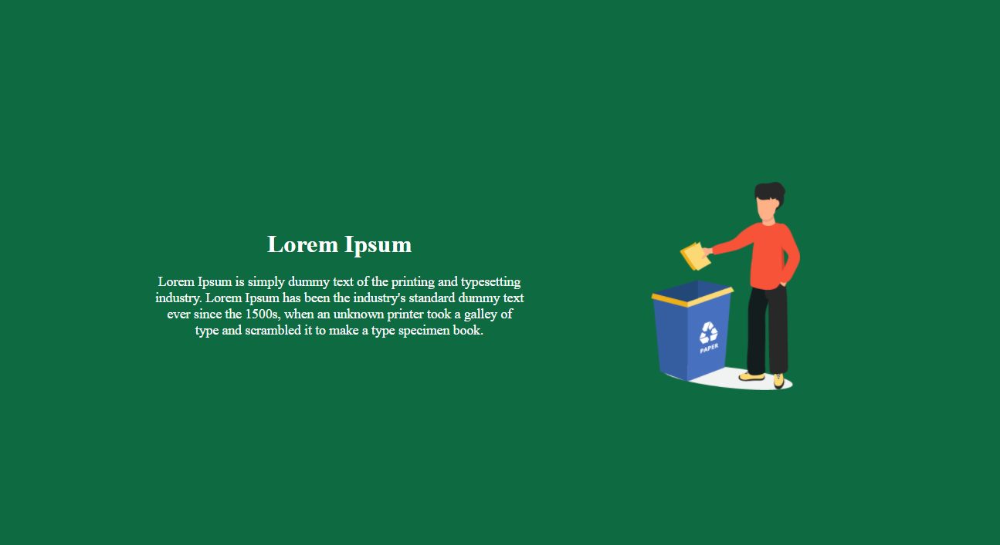

# Recycle Landing Page

A very simple SPA to present how to bin less, recycle more!

* **[Live Preview](https://gu1tekin.com/recyle-landing-page/){:target="_blank" rel="noopener"}**


### Prerequisites

```
A Web Browser 
```

## Built With

* [CSS]
* [HTML]
* [fontawesome]
* [freepik.com]

## Authors

* **Gultkein Cirik** - *Initial work* - [gu1tekin](https://github.com/gu1tekin)

## Some screenshots

Click on glass, plastic, organic or paper avatar and see how to recycle them.





